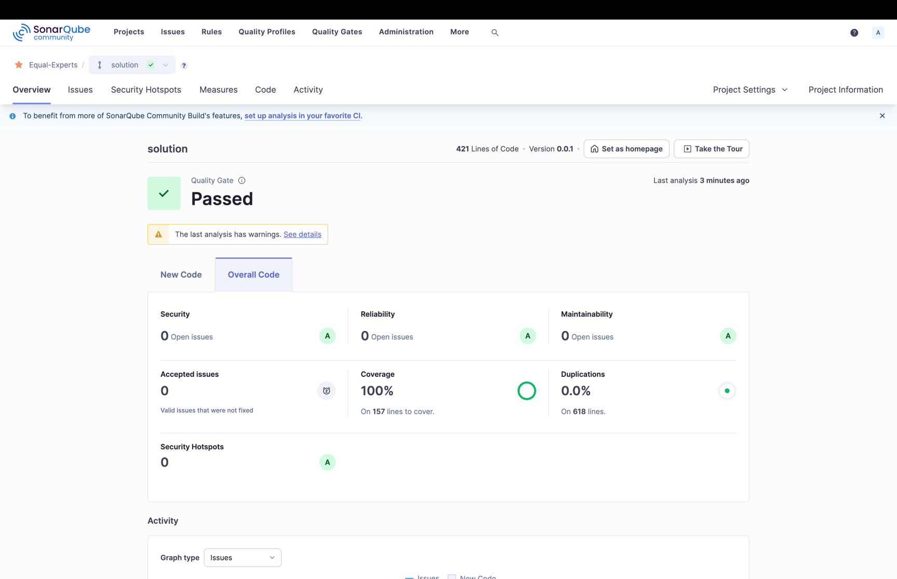
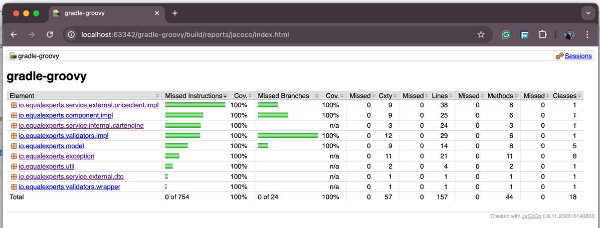

## :warning: Please read these instructions carefully and entirely first

* Clone this repository to your local machine.
* Use your IDE of choice to complete the assignment.
* When you have completed the assignment, you need to push your code to this repository
  and [mark the assignment as completed by clicking here](https://app.snapcode.review/submission_links/7e8f6245-4601-4d8e-99bb-36d8d03ae5a2).
* Once you mark it as completed, your access to this repository will be revoked. Please make sure that you have
  completed the assignment and pushed all code from your local machine to this repository before you click the link.
* There is no time limit for this task - however, for guidance, it is expected to typically take around 1-2 hours.

# Begin the task

Write some code that provides the following basic shopping cart capabilities:

1. Add a product to the cart
   1. Specifying the product name and quantity
   2. Retrieve the product price by issuing a request to the [Price API](#price-api) specified below
   3. Cart state (totals, etc.) must be available

2. Calculate the state:
   1. Cart subtotal (sum of price for all items)
   2. Tax payable (charged at 12.5% on the subtotal)
   3. Total payable (subtotal + tax)
   4. Totals should be rounded up where required (to two decimal places)

## Price API

The price API is an existing API that returns the price details for a product, identified by it's name. The shopping
cart should integrate with the price API to retrieve product prices.

### Price API Service Details

Base URL: `https://equalexperts.github.io/`

View Product: `GET /backend-take-home-test-data/{product}.json`

List of available products

* `cheerios`
* `cornflakes`
* `frosties`
* `shreddies`
* `weetabix`

## Example

The below is a sample with the correct values you can use to confirm your calculations

### Inputs

* Add 1 × cornflakes @ 2.52 each
* Add another 1 x cornflakes @2.52 each
* Add 1 × weetabix @ 9.98 each

### Results

* Cart contains 2 x cornflakes
* Cart contains 1 x weetabix
* Subtotal = 15.02
* Tax = 1.88
* Total = 16.90

## Tips on what we’re looking for

We value simplicity as an architectural virtue and as a development practice. Solutions should reflect the difficulty of
the assigned task, and shouldn’t be overly complex. We prefer simple, well tested solutions over clever solutions.

### DO

* ✅ Include unit tests.
* ✅ Test both any client and logic.
* ✅ Update the README.md with any relevant information, assumptions, and/or tradeoffs you would like to highlight.

### DO NOT

* ❌ Submit any form of app, such as web APIs, browser, desktop, or command-line applications.
* ❌ Add unnecessary layers of abstraction.
* ❌ Add unnecessary patterns/ architectural features that aren’t called for e.g. persistent storage.

# Price API

The price API is an existing API that returns the price details for a product, identified by it's name. The shopping
cart should integrate with the price API to retrieve product prices.

# Docker Compose

To spin up the test-tools required for Code-Quality Metrics. Run the following command:

- Spin-up ` docker compose -f src/test/resources/docker/test-tools.yml up -d`
- Tear-down `docker compose -f src/test/resources/docker/test-tools.yml down --volumes`
- Release resource `docker compose -f src/test/resources/docker/test-tools.yml down -v --remove-orphans`

## Assumptions & Design Decisions

1. API Characteristics
   - Product names are unique and serve as SKUs
   - Price details remain consistent across requests
   - API supports up to 1000 requests/second
   - Idempotent GET operations

2. Error Handling
   - Implements comprehensive exception handling
   - Custom exceptions for different error scenarios
   - Validation at multiple layers (input, price, cart)

3. Architecture Decisions
   - Lightweight in-memory cart implementation
   - No persistence layer as per requirements
   - Separation of concerns (validation, price fetching, cart operations)
   - Thread-safe operations

4. Quality Assurance
   - Unit tests for all components
   - Integration tests for API interaction
   - Code coverage > 99%
   - Sonar quality gates enforcement

5. Future Improvements
   - Add resilience patterns (Circuit Breaker, Retry)
   - Support for multiple tax rates
   - Bulk price fetching optimization
   - Caching layer for price data

## Sequence Diagram

Let's start the fun-challenge by identifying the actors/services involved in the shopping cart system and the flow of
request from one to the next. It makes it easier for me to identify the contracts (interfaces) between the services and
the api. I'm very strong with BDD, but let's try adopt TDD for this challenge.

TDD = Code to interfaces -> write the unit tests -> write the implementation -> refactor -> repeat.

```uml
     User             CartService     PriceAPIGatewayClient   ValidatorProvider       CartFacade             Cart            CartCalculator        TaxCalculator
      |                    |                    |                    |                    |                    |                    |                    |
      |                    |                    |                    |                    |                    |                    |                    |
      |---validateAndAddToCart(name,quantity)-->|                    |                    |                    |                    |                    |
      |                    |                    |                    |                    |                    |                    |                    |
      |                    |-------validateUserInputs--------------->|                    |                    |                    |                    |
      |                    |                    |                    |                    |                    |                    |                    |
      |                    |<---throwCartErrorsIfExist---------------|                    |                    |                    |                    |
      |                    |                    |                    |                    |                    |                    |                    |
      |<---errorsIfExist---|                    |                    |                    |                    |                    |                    |
      |                    |                    |                    |                    |                    |                    |                    |
      |                    |---getPrice(name)-->|                    |                    |                    |                    |                    |
      |                    |                    |                    |                    |                    |                    |                    |
      |                    |<--returnPrice------|                    |                    |                    |                    |                    |
      |                    |                    |                    |                    |                    |                    |                    |
      |                    |-----validatePriceResponse-------------->|                    |                    |                    |                    |
      |                    |                    |                    |                    |                    |                    |                    |
      |                    |<----throwPriceErrorsIfExist-------------|                    |                    |                    |                    |
      |                    |                    |                    |                    |                    |                    |                    |
      |<---errorsIfExist---|                    |                    |                    |                    |                    |                    |
      |                    |                    |                    |                    |                    |                    |                    |
      |                    |-------------------addToCartAndGetTotals--------------------->|                    |                    |                    |
      |                    |                    |                    |                    |                    |                    |                    |
      |                    |                    |                    |                    |-----addToCart----->|                    |                    |
      |                    |                    |                    |                    |                    |                    |                    |
      |                    |                    |                    |                    |                    |---+ 1. addToCart   |                    |
      |                    |                    |                    |                    |                    |   |                |                    |
      |                    |                    |                    |                    |                    |---+                |                    |
      |                    |                    |                    |                    |                    |                    |                    |
      |                    |                    |                    |                    |<---cart+Metadata---|                    |                    |
      |                    |                    |                    |                    |                    |                    |                    |
      |                    |                    |                    |                    |-----------calculateTotals-------------->|                    |
      |                    |                    |                    |                    |                    |                    |                    |
      |                    |                    |                    |                    |                    |                    |---+ 1.subTotCalc   |
      |                    |                    |                    |                    |                    |                    |   |                |
      |                    |                    |                    |                    |                    |                    |   |                |
      |                    |                    |                    |                    |                    |                    |   |                |
      |                    |                    |                    |                    |                    |                    |   | 2.getTaxAmnt-->|
      |                    |                    |                    |                    |                    |                    |   |                |
      |                    |                    |                    |                    |                    |                    |   |<----taxAmnt----|
      |                    |                    |                    |                    |                    |                    |   |                |
      |                    |                    |                    |                    |                    |                    |   |                |
      |                    |                    |                    |                    |                    |                    |---+ 3.total        |
      |                    |                    |                    |                    |                    |                    |                    |
      |                    |                    |                    |                    |<--------returnCartTotals----------------|                    |
      |                    |                    |                    |                    |                    |                    |                    |
      |                    |<--------------------------returnCartTotals-------------------|                    |                    |                    |
      |                    |                    |                    |                    |                    |                    |                    |
      |<---showUserTotals--|                    |                    |                    |                    |                    |                    |
      |                    |                    |                    |                    |                    |                    |                    |
      

New Flow: User -> CartService
                        |
                        |-> PriceAPIGatewayClient (has a ValidatorProvider)
                        |-> Cart (has a ValidatorProvider)
                        |-> CartCalculator (has a TaxCalculator)
Error Flow
-------------
1. Invalid Input Validation:
   Client -> CartService: validateAndAddToCart(product with invalid data)
   CartService -> ValidatorProvider: validateData(product)
   ValidatorProvider -> CartService: throw CartValidationException
   CartService -> Client: return ConsolidatedCart with CartError (400, VALIDATION_ERROR)

2. Invalid Product (Not Found):
   Client -> CartService: validateAndAddToCart(non-existent product)
   CartService -> PriceAPIClient: getPrice(product)
   PriceAPIClient -> CartService: throw Api400xError (404)
   CartService -> Client: return ConsolidatedCart with CartError (404, NOT_FOUND_ERROR)

3. Price Service Error:
   Client -> CartService: validateAndAddToCart(product)
   CartService -> PriceAPIClient: getPrice(product)
   PriceAPIClient -> CartService: throw HttpAPIException
   CartService -> Client: return ConsolidatedCart with CartError (500, PRICE_SERVICE_ERROR)

4. Cart Operation Error:
   Client -> CartService: validateAndAddToCart(product)
   CartService -> Cart: addProduct(product, price)
   Cart -> CartService: throw CartException
   CartService -> Client: return ConsolidatedCart with CartError (400, VALIDATION_ERROR)

5. Invalid Price Response:
   Client -> CartService: validateAndAddToCart(product)
   CartService -> ValidatorProvider: validateData(priceWrapper)
   ValidatorProvider -> CartService: throw PriceServiceException
   CartService -> Client: return ConsolidatedCart with CartError (400, PRICE_SERVICE_ERROR)
   
```

## Manifest

Software libraries that were used in the project, and need to be updated regularly to ensure the system is secure and
up-to-date. The table below

AS - Active Support
SS - Security Support

| Dependency      |  Version   |   AS EoL    |   SS EoL    | Last Updated |
|:----------------|:----------:|:-----------:|:-----------:|:------------:|
| Open-JDK        | 21.0.6-tem | 31-Dec-2029 | 31-Sep-2029 | 15-Feb-2025  |
| SDK-MAN         |   5.19.0   |      -      |      -      | 15-Feb-2025  |
| Gradle          |    8.10    |     LTS     |     LTS     | 15-Feb-2025  |
| Gson            |   2.12.1   |      -      |      -      | 15-Feb-2025  |
| Log4j           |   2.24.3   |      -      |      -      | 15-Feb-2025  |
| Hiber-Validator | 9.0.0.CR1  |      -      |      -      | 15-Feb-2025  |
| Lombok          |  1.18.36   |      -      |      -      | 15-Feb-2025  |

## Dependency Version Check!

- [OSS End of Life](https://endoflife.date)

## Git Branching Model

Normal flow of code changes between branches.
`feat-*` -> `dev` -> `int-*` -> `qa-*` -> `stress-*` -> `main`

In the event of a bug that's currently in PROD:
`hotfix-*` -> `qa-*` -> `stress-*` -> `main`

`hotfix-*` -> `dev`

Following a successful [Git Branching Model](https://nvie.com/posts/a-successful-git-branching-model/) I would be
adopting the same best practices for this project.

In this project, I will be using the `solution` branch as the default branch for the project. The `main` branch will be
the production branch. The `solution` branch will be merged into the `main` branch after the code review.

# Executing Tests

Classification of tests are used to categorize tests into different groups using tags. This allows for execution of
specific context of tests. Whether it be unit tests, integration tests, or both. Tags: `unit`, `int`.

To run the tests, execute the following command:

- Complete build with tests: `./gradlew clean build`
- All tests: `./gradlew clean test`
- Unit tests: `./gradlew clean test -Ptags=unit`
- Int tests: `./gradlew clean test -Ptags=int`
- Int & Unit tests: `./gradlew clean test -Ptags=int,unit`

# SonarQube Analysis

Execute sonarqube analysis with the following command:
`./gradlew sonar -Dsonar.projectKey=Equal-Experts -Dsonar.projectName='Equal-Experts' -Dsonar.host.url=http://localhost:9000 -Dsonar.token=sqp_eafffb588bf1d4d9b2c5c6f350254a70bb11793f`
Sonarque analysis can be found at: [SonarQube](http://localhost:9000)

- Remember to change the sonar.token value to your own token.
  Screenshots below:

### Current SonarQube Code Quality Metrics:



### After fixing 4 issues raised by SonarQube:


### Resolution graph for the 4 issues:


## Jacoco Test Coverage Report

Find the Jacoco test coverage report in the unix-cmd: `ls -lah build/reports/jacoco/index.html` directory.
Screenshot below:


## Final Quality Report


# Potential Areas of Improvements

- Principle of Least Knowledge in CartFacade: Keep the method calls within the bounded-context of the inner classes. ✅
   - Added Cart-Views to enforce Least Knowledge Principle by making use of Command Query Separation (CQS) pattern. ✅
   - Fix the ConsolidatedCart: "God Object" syndrome. ✅
- Spin-up local Sonarqube server for additional code quality checks. ✅
- Support for different tax rates. ✅
- Decoupled tax-calculation from CartCalculator. ✅
- Decoupled cart-items calculation from Cart. ✅
- Feature to remove items from an existing Cart.❓
- Complete the negative testing for the Price-API response.✅
- Update the Sequence Diagram with the new features.✅
- Add resilience patterns (Circuit Breaker, Retry): Resilience4j.❓
- Async Bulk price fetching optimization: Caching layer for price data, & agree with price-api-client on data-refresh
  rate/frequency for Cache-Eviction.❓
- Caching layer for price data: Caffeine, Ehcache.❓

# Issues Discovered from Assessment Feedback

1. Remove hardcoded Base-URL & API-Endpoint from the PriceAPIGatewayClient❗❗❗❓15mins (including Unit Tests)
2. Return an immutable map (`Collections.unmodifiableMap()`) for the Cart.❓ 2mins (including Unit Tests)
3. The ItemMetadata is mutable❗❗❗❓ 30mins (including Unit Tests)
4. Simplify the CartCalculator:

- Remove the unnecessary layer of abstraction (CartFacade).❓3hrs (including unit tests)
- Validator is not a service, but a utility.❓2mins (including unit tests)

5. Simplified version: 2hrs (including unit tests)

-       CartService -> Validator Utility - Validate (ProductInput + PriceApi) 
                -> ShoppingCart - Keeping track of CartItems
                -> CartCalculator - Calculate Totals
                -> TaxCalculator - Calculate tax
                -> PriceApi - Get Product Price 

6. Do not expose the CartMap for potential modifications.❓